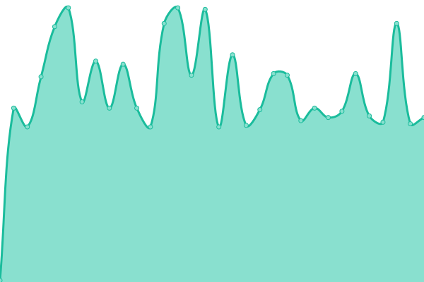
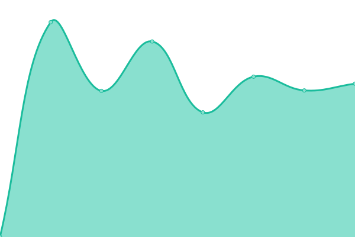
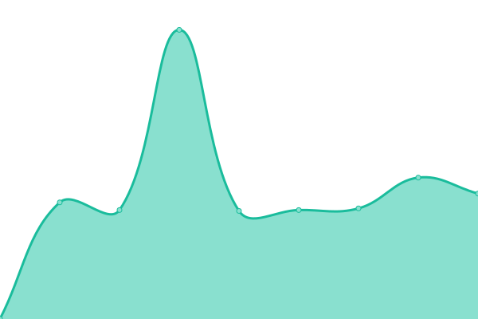
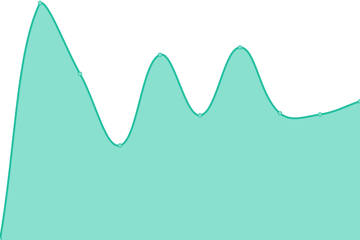
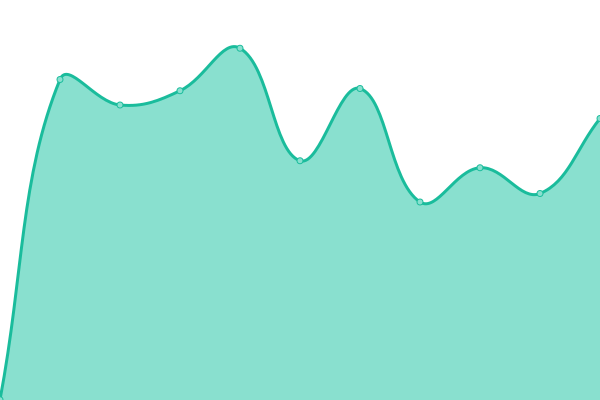

# [📈 Live Status](https://status.phimado.de): <!--live status--> **Alle Systeme sind online**

This repository contains the open-source uptime monitor and status page for [Upptime](https://upptime.js.org), powered by [Upptime](https://github.com/upptime/upptime).

With [Upptime](https://upptime.js.org), you can get your own unlimited and free uptime monitor and status page, powered entirely by a GitHub repository. We use [Issues](https://github.com/upptime/upptime/issues) as incident reports, [Actions](https://github.com/phimado/status/actions) as uptime monitors, and [Pages](https://status.phimado.de) for the status page.

<!--start: status pages-->
<!-- This summary is generated by Upptime (https://github.com/upptime/upptime) -->
<!-- Do not edit this manually, your changes will be overwritten -->
<!-- prettier-ignore -->
| URL | Status | History | Response Time | Uptime |
| --- | ------ | ------- | ------------- | ------ |
|  [SRV01 Web](89.22.112.170) | Online | [srv-01-web.yml](https://github.com/phimado/status/commits/HEAD/history/srv-01-web.yml) | 

 119ms
     
 | 

<a href="https://status.phimado.de/history/srv-01-web">99.79%</a>
    

|  [SRV01 Mail](89.22.112.170) | Online | [srv-01-mail.yml](https://github.com/phimado/status/commits/HEAD/history/srv-01-mail.yml) | 

 119ms
     
 | 

<a href="https://status.phimado.de/history/srv-01-mail">99.81%</a>
    

|  [SRV01 Plesk Panel](https://srv01.phimado.de:8443) | Online | [srv-01-plesk-panel.yml](https://github.com/phimado/status/commits/HEAD/history/srv-01-plesk-panel.yml) | 

 1328ms
     
 | 

<a href="https://status.phimado.de/history/srv-01-plesk-panel">99.81%</a>
    

|  [PHIMADO](https://phimado.de) | Online | [phimado.yml](https://github.com/phimado/status/commits/HEAD/history/phimado.yml) | 

 938ms
     
 | 

<a href="https://status.phimado.de/history/phimado">99.81%</a>
    

|  [ECDC](https://memmingen-indians.de) | Online | [ecdc.yml](https://github.com/phimado/status/commits/HEAD/history/ecdc.yml) | 

 1214ms
     
 | 

<a href="https://status.phimado.de/history/ecdc">99.81%</a>
    

|  [ECDC Shop](https://shop.memmingen-indians.de) | Online | [ecdc-shop.yml](https://github.com/phimado/status/commits/HEAD/history/ecdc-shop.yml) | 

 3901ms
     
 | 

<a href="https://status.phimado.de/history/ecdc-shop">98.89%</a>
    

|  [ECDC Frauen](https://fraueneishockey-mm.de) | Online | [ecdc-frauen.yml](https://github.com/phimado/status/commits/HEAD/history/ecdc-frauen.yml) | 

 1266ms
     
 | 

<a href="https://status.phimado.de/history/ecdc-frauen">99.82%</a>
    

|  [JB SportManagement](https://jb-sport.de) | Online | [jb-sport-management.yml](https://github.com/phimado/status/commits/HEAD/history/jb-sport-management.yml) | 

 1016ms
     
 | 

<a href="https://status.phimado.de/history/jb-sport-management">99.82%</a>
    

|  [Mendes](https://mendes.de) | Online | [mendes.yml](https://github.com/phimado/status/commits/HEAD/history/mendes.yml) | 

 2304ms
     
 | 

<a href="https://status.phimado.de/history/mendes">100.00%</a>
    

|  [Memminger Marionettentheater](https://memminger-marionettentheater.de) | Online | [memminger-marionettentheater.yml](https://github.com/phimado/status/commits/HEAD/history/memminger-marionettentheater.yml) | 

 998ms
     
 | 

<a href="https://status.phimado.de/history/memminger-marionettentheater">99.82%</a>
    

|  [Grundschule Benningen-Lachen](https://gs-benningen-lachen.de) | Online | [grundschule-benningen-lachen.yml](https://github.com/phimado/status/commits/HEAD/history/grundschule-benningen-lachen.yml) | 

 2469ms
     
 | 

<a href="https://status.phimado.de/history/grundschule-benningen-lachen">98.90%</a>
    

<!--end: status pages-->

[**Visit our status website →**](https://status.phimado.de)

## 📄 License

- Powered by: [Upptime](https://github.com/upptime/upptime)
- Code: [MIT](./LICENSE) © [Upptime](https://upptime.js.org)
- Data in the `./history` directory: [Open Database License](https://opendatacommons.org/licenses/odbl/1-0/)
